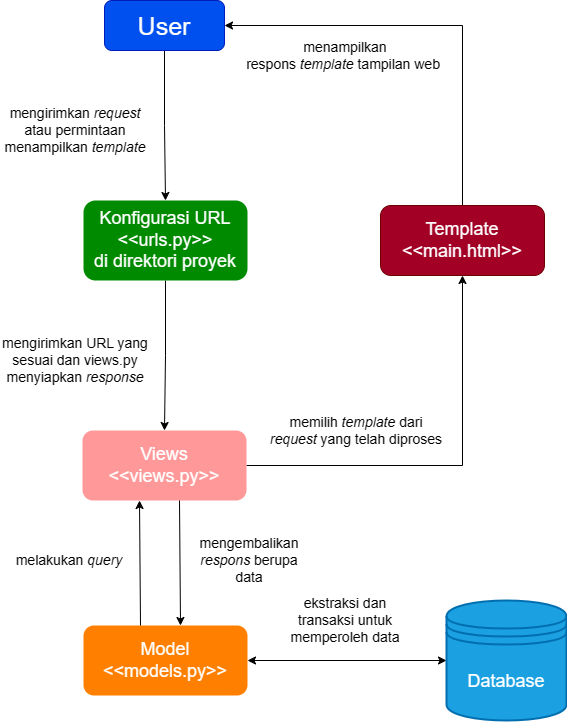
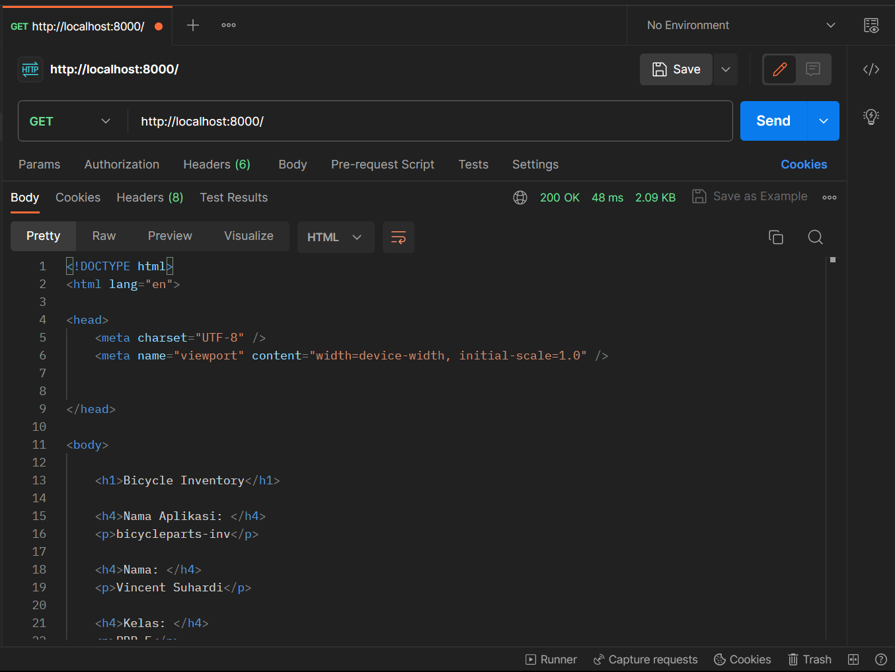
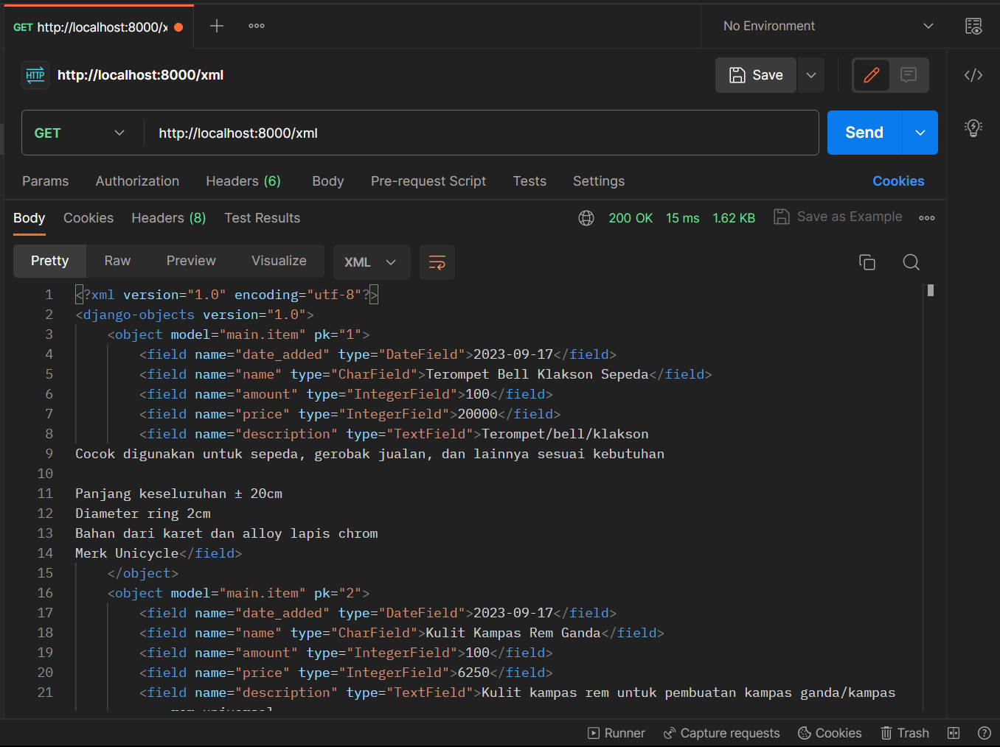
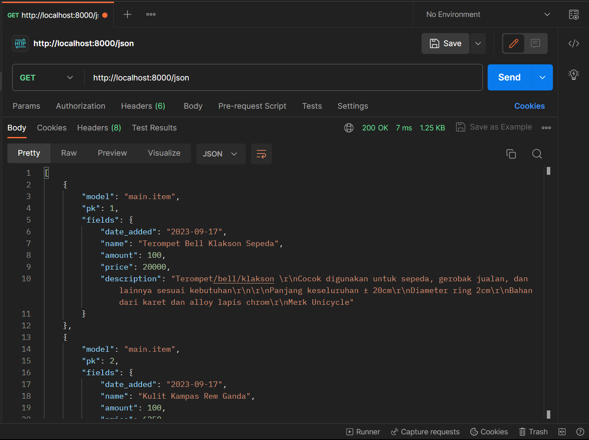
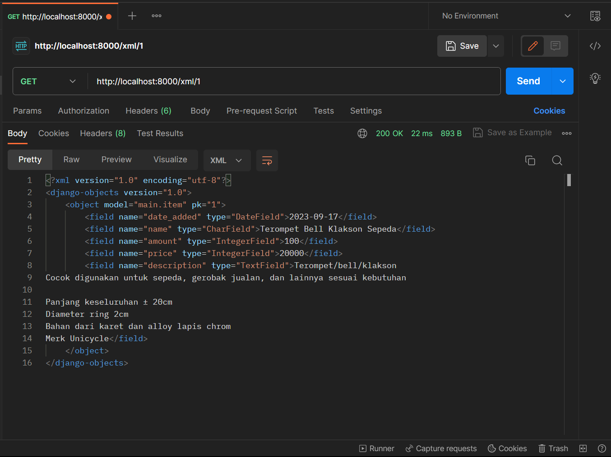
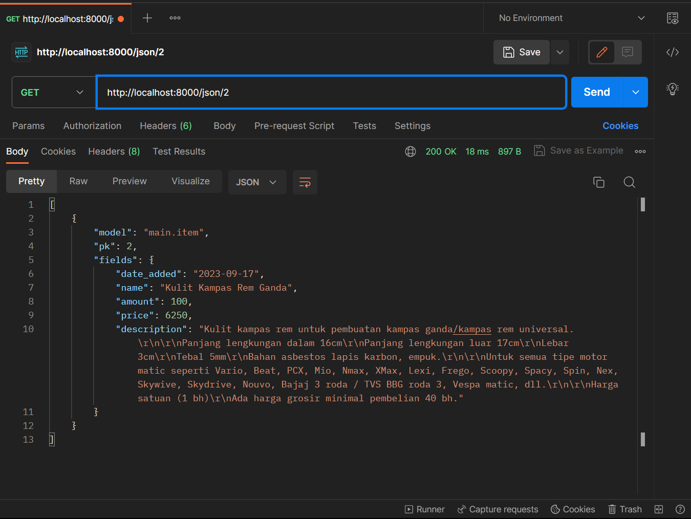

Link : https://bicycleinv-app.adaptable.app/main/

## Nama    : Vincent Suhardi
## NPM     : 2206082505
## Kelas   : PBP F

## Tugas 2
### Jelaskan bagaimana cara kamu mengimplementasikan __checklist__ di atas secara __step-by-step__ (bukan hanya sekedar mengikuti tutorial).

**1. Membuat proyek Django baru.** \
Langkah awal yang saya lakukan dalam memulai proyek ini adalah dengan membuat repositori (repo) GitHub baru. Setelah itu, inisiasi repo lokal pada komputer saya dengan menggunakan perintah `git init`. Sebelum saya memulai inisiasi proyek Django, _best practice_ yang perlu dilakukan adalah untuk mengaktifkan _virtual environment_ Python. Ini akan membantu memisahkan dependensi proyek ini dari proyek Django lainnya, memastikan keselamatan dan konsistensi pada proyek. Setelah _virtual environment_ aktif, langkah selanjutnya adalah menyiapkan komponen-komponen penting yang dibutuhkan untuk aplikasi dan menyimpannya dalam file bernama `requirements.txt`. File ini berisi daftar dependensi yang diperlukan untuk menjalankan proyek saya. Saya kemudian menginstal file yang berisikan dependensi-dependensi ini menggunakan perintah `pip install` milik Python. Setelah semua dependensi terinstal, saya menggunakan perintah `startproject` untuk membuat struktur direktori proyek Django yang sesuai dengan persiapan dependensi. Pada langkah selanjutnya, saya melakukan konfigurasi terhadap file `settings.py` dengan mengizinkan akses dari semua host agar proyek dapat diakses dengan lebih mudah pada tahap pengembangan awal. Kemudian saya membuat file `.gitignore` yang diletakkan pada direktori utama sekaligus repo lokal yang dihubungkan dengan repo pada GitHub. File ini berisikan pola-pola teks file/direktori untuk diabaikan. Akhirnya, saya melakukan push commit repo lokal untuk memperbarui komponen pada repo di GitHub.

**2. Membuat aplikasi dengan nama `main` pada proyek tersebut.** \
_Virtual environment_ tetap saya aktivasikan terlebih dahulu. Kemudian menggunakan script `manage.py` yang sudah berada di dalam direktori utama, saya menggunakan perintah `python manage.py startapp main` pada _command prompt_ untuk menginisiasi aplikasi `main` pada proyek. Untuk memberitahu proyek Django bahwa saya telah menginisiasi aplikasi yang baru, saya menambahkan `main` (nama aplikasi) pada list `INSTALLED_APPS` yang berada di `settings.py` direktori proyek.

**3. Melakukan _routing_ pada proyek agar dapat menjalankan aplikasi `main`.** \
Pembuatan pola URL berada di `urls.py` pada direktori proyek `bicycleparts_inv`. Saya mengambil _method_ `include` dan `path` dari _library_ `django.urls` untuk membentuk pola URL dari aplikasi-aplikasi yang berada pada proyek. Pada kode `urls.py`, ditambahkan _method_ `path` pada list `urlpatterns` yang menerima dua argumen yaitu rute berupa `main/` dan juga pengarahan menggunakan `include` ke file `urls.py` yang berada pada direktori aplikasi `main` sebelumnya.

**4. Membuat model pada aplikasi `main` dengan nama `Item` dan memiliki atribut wajib sebagai berikut.** \
**- `name` sebagai nama _item_ dengan tipe `CharField`.** \
**- `amount` sebagai jumlah _item_ dengan tipe `IntegerField`.** \
**- `description` sebagai deskripsi _item_ dengan tipe `TextField`.** \
Dalam tahap ini, saya mengisikan file `models.py` yang berfungsi sebagai bagian Model dari aplikasi. Pada file tersebut, saya mengimpor `models` terlebih dahulu dari _library_ `django.db`. Kemudian saya membuat model baru `Item` yang dibuat dengan membentuk suatu _class_ yang merupakan _subclass_ dari `models.Model`. Pada _class_ model yang telah dibuat, ditambahkan beberapa _field_ atau atribut untuk model sebagai berikut:
- `date_added` menggunakan atribut `DateField`.
- `name` menggunakan atribut `CharField`.
- `amount` menggunakan atribut `IntegerField`.
- `price` menggunakan atribut `IntegerField`.
- `description` menggunakan atribut `TextField`.

**5. Membuat sebuah fungsi pada `views.py` untuk dikembalikan ke dalam sebuah _template_ HTML yang menampilkan nama aplikasi serta nama dan kelas kamu.** \
Pada `views.py`, saya mengawali dengan mengimpor `render` dari _library_ `django.shortcuts` sebagai _method_ yang berfungsi untuk mengembalikan respons HTTP yang akan menampilkan _template_ yang sesuai. Di dalam fungsi ini, saya membuat _dictionary_ `context` yang berisikan beberapa data, yaitu `app_name` (nama aplikasi), `name` (nama saya), dan `class` (kelas mata kuliah PBP), untuk ditampilkan. Fungsi berakhir dengan memanggil _method_ `render` yang akan menampilkan `main.html` dengan data yang sesuai `context`. 

**6. Membuat sebuah _routing_ pada `urls.py` aplikasi main untuk memetakan fungsi yang telah dibuat pada `views.py`.** \
Pada file `urls.py` yang berada pada direktori aplikasi `main`, saya menambahkan pola URL pada list `urlpatterns` untuk aplikasi dengan menggunakan _method_ yang sama seperti pada `urls.py` pada direktori proyek, yaitu `path` dari _library_ `django.urls`. `path` di sini menerima tiga argumen berupa rute dari `views.py` yang merupakan _string_ kosong sebab berada di direktori yang sama, fungsi `show_main` yang sudah dibuat dalam file `views.py`, dan nama dari pola URL.

**7. Melakukan deployment ke Adaptable terhadap aplikasi yang sudah dibuat sehingga nantinya dapat diakses oleh teman-temanmu melalui Internet.** \
Setelah selesai melakukan konfigurasi, _commit_ dan _push_ terhadap proyek, saya menuju ke situs web Adaptable. Saya melakukan _sign-in_ terlebih dahulu untuk menghubungkan repo yang berada pada GitHub ke Adaptable. Kemudian saya memilih repo `bicycleparts-inv` sebagai repo proyek yang ingin di-_deploy_. Setelah itu, saya memilih beberapa opsi lainnya seperti `Python App Template` sebagai tipe _template_ dari proyek dan `PostgreSQL` sebagai _database management system_ yang akan digunakan oleh model dari aplikasi proyek. Terdapat juga beberapa konfigurasi yang saya lakukan seperti menyesuaikan versi Python, memasukkan perintah yang sesuai pada `Start Command`, yaitu `python manage.py migrate && gunicorn bicycleparts_inv.wsgi` khusus untuk proyek saya, dan juga mencentang bagian `HTTP Listener on Port`. Akhirnya, proyek akan di-_deploy_.

### Buatlah bagan yang berisi _request_ client ke web aplikasi berbasis Django beserta responnya dan jelaskan pada bagan tersebut kaitan antara `urls.py`, `views.py`, `models.py`, dan berkas `html`.

### Jelaskan mengapa kita menggunakan **_virtual environment_**? Apakah kita tetap dapat membuat aplikasi web berbasis Django tanpa menggunakan **_virtual environment_**?
Kita perlu menggunakan atau mengaktivasi _virtual environment_ ketika ingin mengembangkan suatu proyek agar perubahan yang kita lakukan terhadap sistem, seperti perubahan _dependencies_, tidak mempengaruhi _dependencies_ pada proyek. Contoh lain, bila kita ingin membuat beberapa proyek, kita harus mengaktivasi _virtual environment_ untuk masing-masing proyek agar perbedaan antara versi Python atau _dependencies_ yang dimiliki oleh setiap proyek tidak saling mempengaruhi satu dengan lainnya.

Aplikasi web berbasis Django tetap dapat dibuat tanpa menggunakan _virtual environment_, namun akan muncul beberapa konflik antara _dependencies_ dari berbagai macam proyek Django. Contohnya, pembuatan proyek tanpa menggunakan _virtual environment_ akan mengakibatkan suatu proyek menggunakan _dependencies_ yang sama dengan proyek lainnya atau yang berada pada sistem. Kita tentu tidak akan mengingat _dependencies_ apa saja yang kita butuhkan untuk proyek dan harus menggunakan semua _dependencies_ yang dibutuhkan dan yang tidak dibutuhkan. Jadi, meskipun proyek tetap dapat dikembangkan tanpa mengaktivasi _virtual environment_, tetapi akan sangat memperlambat pengerjaan.

### Jelaskan apakah itu MVC, MVT, MVVM dan perbedaan dari ketiganya.
- MVC dibagi menjadi _Model_, _View_, dan _Controller_. Arsitektur ini dimulai dengan pengguna yang meminta _request_ terhadap _Controller_ terlebih dahulu. _Controller_ akan memproses _request_ data pengguna melalui _Model_ yang akan kemudian ditampilkan pada komponen _View_ dari arsitektur MVC.
- MVT dibagi menjadi _Model_, _View_, dan _Template_. Pengguna akan mengakses konfigurasi URL yang akan memberikan _request_ terhadap komponen _View_. Kemudian _View_ akan melakukan _query_ terhadap komponen _Model_ yang akan melakukan transaksi atau ekstraksi data dari suatu DBMS (_Database Management System_). Setelah _Model_ memperoleh data dari database, _Model_ akan mengirimkan _response_ kembali ke _View_ dan _View_ akan memilih _template_ tampilan yang sesuai dengan data yang diambil. Setelah _template_ ditentukan, bagian _Template_ dari arsitektur akan menampilkannya ke pengguna.
- MVVM dibagi menjadi _Model_, _View_, dan _View-Model_. Pada arsitektur ini, _View-Model_ bertindak sebagai perantara antara komponen _View_ dengan _Model_. _View_ memberitahu aksi dari pengguna kepada _View-Model_ dan kemudian berhubungan dengan _Model_ untuk mengambil atau menyimpan data. _View-Model_ juga bertanggung jawab atas _methods_, perintah, dan unsur-unsur lainnya yang menjaga keadaan dari _View_, mengambil data dari _Model_, dan menginisiasi suatu aksi pada _View_.

Perbedaan utama dari ketiganya adalah bagaimana komponen _Model_ dan _View_ saling terhubung untuk mengakses data dan menampilkan suatu tampilan bagi pengguna sesuai dengan data yang di-_query_.

## Tugas 3
### Apa perbedaan antara form `POST` dan `GET` dalam Django?
`POST` merupakan segala _request_ yang dapat menambahkan, menghapus, atau merubah keadaan pada server, contohnya penambahan data baru pada database. Sedangkan `GET` juga merupakan suatu _request_ tetapi hanya bertujuan untuk mengambil atau menerima data dan tidak melakukan perubahan terhadap server.

### Apa perbedaan utama antara XML, JSON, dan HTML dalam konteks pengiriman data?
HTML merupakan suatu kerangka dari sebuah web di mana dalam konteks pengiriman data, HTML digunakan untuk menampilkan data melalui format penulisan yang sudah dibuat pada HTML. Sedangkan berkas XML dan JSON memiliki fungsi yang saman yaitu untuk menyimpan data yang diterima dari _request_ pengguna melalui HTML dan juga berfungsi untuk melakukan transmisi data kembali ke tampilan HTML. Perbedaan XML dan JSON berada pada struktur berkasnya di mana XML memiliki struktur seperti pohon dan JSON memiliki struktur _key-value pair_ seperti struktur data _dictionary_.

### Mengapa JSON sering digunakan dalam pertukaran data antara aplikasi web modern?
Berkas JSON menggunakan sintaks bahasa pemrograman _Javascript_ yang banyak digunakan oleh pengembang aplikasi web modern. JSON menyimpan data dalam bentuk array sehingga dapat melakukan transmisi data dengan lebih cepat dan juga memiliki struktur yang lebih mudah dibaca oleh pengguna dibandingkan dengan XML.

### Jelaskan bagaimana cara kamu mengimplementasikan checklist di atas secara step-by-step (bukan hanya sekadar mengikuti tutorial).
**1. Membuat input `form` untuk menambahkan objek model pada app sebelumnya.** \
Saya memulai dengan membuat berkas baru yang dinamakan `forms.py` pada direktori aplikasi `main` untuk membangun struktur yang dapat menerima input pengguna masuk ke dalam model aplikasi. Pada berkas tersebut, saya membuat kelas baru yang saya namakan `ItemForm`. Kelas ini merupakan subclass dari kelas `ModelForm` dari _library_ `django.forms` yang digunakan untuk membangun aplikasi yang memiliki database. Kemudian saya tambahkan kelas lagi di dalam kelas `ItemForm` yang dinamakan `Meta` yang bertujuan untuk mendefinisikan informasi (_metadata_) yang dapat diisikan pada _form_. Kelas `Meta` memiliki dua variabel yaitu variabel `model` yang menerima kelas model yang sudah dibuat sebelumnya di `models.py` dinamakan `Item` dan juga _fields_ atau data-data apa saja yang telah kita definisikan pada model.

**2. Tambahkan 5 fungsi views untuk melihat objek yang sudah ditambahkan dalam format HTML, XML, JSON, XML by ID, dan JSON by ID.** \
Saya memulai pembuatan fungsi dengan mengimpor beberapa _library_ dari Django, yaitu `HttpResponseRedirect`, `HttpResponse`, `reverse`, dan `serializers`. 

Untuk format HTML, saya membuat fungsi baru yang dinamakan `create_item` yang menerima parameter _request_. Fungsi ini bertujuan untuk membuat suatu formulir yang dapat menerima data baru dari _input_ pengguna dan diawali dengan pembuatan kelas `ItemForm` yang menerima parameter `request.POST` **atau** `None` untuk menerima _request_ data dari pengguna menggunakan metode `POST` yang dapat mengubah model aplikasi. Kemudian dilakukan validasi terhadap _object form_ yang telah dibuat dan bila valid maka akan disimpan isi data dari _form_ dan mengembalikan halaman web ke `main.html`. \

Untuk format XML dan JSON, saya membuat fungsi `show_xml` untuk tampilan XML dan `show_json` untuk tampilan JSON dari data yang sudah berada pada model database. Masing-masing fungsi tersebut mengambil seluruh data dari model dengan sintaks `Item.objects.all()` dan menggunakan fungsi `HttpResponse` dengan parameter `serializers.serialize` untuk men-_translate_ tampilan respons dari aplikasi menjadi dalam bentuk XML atau JSON.

Untuk format XML dan JSON by ID, saya membuat fungsi `show_xml_by_id` untuk format XML dan `show_json_by_id` untuk format JSON. Kedua fungsi ini menerima parameter _request_ dan `id` sebagai ID dari data yang ingin diakses. Fungsi berawal dengan pengambilan data menggunakan metode `.filter()` berdasarkan ID yang ingin diperoleh, selengkapnya `Item.objects.filter(pk=id)`. Sama dengan kedua fungsi `show_xml` dan `show_json` sebelumnya, fungsi-fungsi ini menggunakan fungsi `HttpResponse` dengan parameter `serializers.serialize` tetapi dengan data yang berdasarkan ID yang diinginkan.

**3. Membuat routing URL untuk masing-masing `views` yang telah ditambahkan pada poin 2.**
Tahap ini dilakukan di dalam berkas `urls.py` di mana untuk setiap fungsi, akan ditambahkan sebuah URL menggunakan fungsi `path` dari _library_ `django.urls`. Setiap fungsi dari `views.py` akan diimpor ke dalam berkas ini dan masing-masing _path_ akan dimasukkan ke dalam _list_ `urlpatterns` dengan penjelasan dari setiap fungsi sebagai berikut:
- Fungsi `create_item` diberikan _path_ `create-item` dan nama `create_item`.
- Fungsi `show_xml` diberikan _path_ `xml/` dan nama `show_xml`.
- Fungsi `show_json` diberikan _path_ `json/` dan nama `show_json`.
- Fungsi `show_xml_by_id` diberikan _path_ `xml/<int:id>/` dan  nama `show_xml_by_id`.
- Fungsi `show_json_by_id` diberikan _path_ `json/<int:id>/` dan nama `show_json_by_id`.
`<int:id>` pada fungsi `show_xml_by_id` dan `show_json_by_id` merupakan sebuah _placeholder_ bagi ID XML/JSON yang ingin ditampilkan kepada pengguna.

### Mengakses kelima URL di poin 2 menggunakan Postman, membuat screenshot dari hasil akses URL pada Postman, dan menambahkannya ke dalam README.md.
#### HTML Viewer

#### XML Viewer

#### JSON Viewer

#### XML by ID Viewer

#### JSON by ID Viewer

## Tugas 4
### Apa itu Django `UserCreationForm`, dan jelaskan apa kelebihan dan kekurangannya?
`UserCreationForm` merupakan sistem autentikasi pengguna milik Django yang digunakan untuk melakukan registrasi terhadap pengguna-pengguna baru ke dalam sistem situs web. Sistem ini menyimpan data pengguna yang telah melakukan registrasi ke dalam database dan juga dapat melakukan validasi terhadap _username_ dan _password_ yang di-_input_ oleh pengguna.

**Kelebihan** \
Dengan `UserCreationForm` kita dapat membuat _form_ registrasi dengan lebih cepat dan mudah dengna fungsionalitas tanpa perlu melakukan pemrograman sendiri hanya dengan mengambil dari framework Django. Selain itu, keamanan _password_ secara umum sudah tertangani dengan mengukur kekuatan dari _password_ serta proses _hashing_ secara otomatis dilakukan oleh sistem.

**Kekurangan** \
Penambahan fitur-fitur registrasi yang baru seperti gambar atau deskripsi profil perlu dibuat lagi secara manual karena `UserCreationForm` hanya memberikan _fields_ untuk _password_, _username_, email, nama depan, dan nama belakang. Sistem form ini juga tidak menangani validasi yang lebih kompleks dan harus kita modifikasi atau membuat _form_ baru secara manual. Verifikasi email untuk meningkatkan keamanan ketika melakukan registrasi juga tidak dapat dilakukan oleh sistem ini.

### Apa perbedaan antara autentikasi dan otorisasi dalam konteks Django, dan mengapa keduanya penting?
Autentikasi merupakan validasi data, seperti _username_ dan _password_, pengguna ketika ingin melakukan proses _login_ sedangkan otorisasi merupakan hal apa saja yang dapat dilakukan atau komponen apa saja yang dimiliki oleh pengguna yang telah melakukan registrasi tersebut. Keduanya sangat penting dalam segi keamanan di mana untuk autentikasi, data dan privasi pengguna dapat dijaga untuk mencegah adanya hal-hal buruk seperti kebocoran data. Otorisasi membeirkan batasan-batasan terhadap apa yang boleh dan tidak boleh diakses terhadap pengguna. Tanpa adanya proses otorisasi terlebih dahulu, pengguna dapat mengakses informasi-informasi atau data penting yang dapat mengancam suatu perusahaan, lembaga, atau organisasi bila disebarkan.

### Apa itu cookies dalam konteks aplikasi web, dan bagaimana Django menggunakan cookies untuk mengelola data sesi pengguna?
_Cookies_ merupakan cara kita membuat sifat _stateless_ aplikasi web, yang menggunakan HTTP, menjadi _stateful_. Dengan perubahan sifat ini, situs web dapat mengingat informasi yang berada pada sisi klien untuk ditampilkan pada sesi-sesi penggunaan web berikutnya. Hal ini dapat terjadi karena _cookies_ akan mengirimkan informasi dari _web browser_ menuju _web browser_. Django menggunakan prinsip yang sama ketika menggunakan _cookies_ di mana setiap _cookie_ memiliki ID sesi (_session_ ID) yang unik untuk mengidentifikasi sesi yang tepat ketika aplikasi web terhubung dengan server. Isi data dari sesi tersebut disimpan ke dalam _database_ secara _default_, namun kita mengkonfigurasi Django agar dapat disimpan ke tempat yang lain.

### Apakah penggunaan cookies aman secara default dalam pengembangan web, atau apakah ada risiko potensial yang harus diwaspadai?
Penggunaan _cookies_ tetap dapat membeirkan risiko keamanan yang dapat mengancam data pribadi pengguna. Beberapa aplikasi web akan menyimpan sesi pada _cookies_ secara default dan ini mampu membuat web melihat data aktivitas kita. Hal ini biasanya dilakukan untuk membuat pengalaman pengguna yang lebih terpersonalisas, tetapi terdapat juga beberapa situs web yang mencuri data tersebut untuk tindakan kriminal seperti penjualan data.

### Jelaskan bagaimana cara kamu mengimplementasikan checklist di atas secara step-by-step (bukan hanya sekadar mengikuti tutorial).
1. Mengimplementasikan fungsi registrasi, login, dan logout untuk memungkinkan pengguna untuk mengakses aplikasi sebelumnya dengan lancar. \
Semua implementasi registrasi, login, dan logout dilakukan pada berkas `views.py`. Pada berkas tersebut, saya melakukan impor fungsi-fungsi terlebih dahulu, yaitu `redirect`, `UserCreationForm`, `messages`, `login`, dan `logout`. Secara singkat pada tahap ini, saya menambahkan beberapa fungsi yang kemudian akan dihubungkan dengan HTML untuk masing-masing fungsi. Kemudian saya membuat path untuk setiap berkas HTML pada `urls.py`. \
**- Register** \
Pertama-tama, saya membuat fungsi `register` dengan parameter `request` menggunakan `UserCreationForm` yang merupakan _form_ Django yang digunakan untuk mengumpulkan informasi pendaftaran pengguna baru. Setelah itu, fungsi memeriksa bila pengguna mengirimkan data menggunakan metode POST melalui formulir, maka akan dibuat formulir yang akan melalui proses validasi yang didefinisikan oleh `UserCreationForm`. Jika data yang dikirimkan pengguna valid, maka `form.save()` akan menyimpan informasi pendaftaran pengguna ke dalam _database_. Kemudian akan ditampilkan sebuah _message_ "Akun berhasil dibuat!" yang menandakan bahwa akun pengguna berhasil dibuat. Setelah akun berhasil dibuat `redirect('main:login)`, pengguna akan diarahkan kembali ke halaman login dan formulir akan di-_render_ ke halaman HTML `register.html` agar pengguna dapat melihat konteks informasi pengguna pada formulir pendaftaran. Untuk mengakses `register.html`, saya mengimpor fungsi `register` ke dalam berkas `urls.py` untuk membuat _path_ URL menuju bagian _register_ dari aplikasi web. \
**- Login** \
Untuk proses _login_, ditambahkan fungsi baru lagi ke dalam `views.py` yang dinamakan `login_user` dengan parameter `request`. Ketika pengguna mengirimkan data melalui formulir _login_, sistem akan mengambil _username_ dan _password_ dari _request_ pengguna melalui permintaan POST. Kedua informasi tersebut akan dilakukan proses autentikasi oleh Django untuk memeriksa apakah kombinasi _username_ dan _password_ yang dimasukkan oleh pengguna valid. Jika valid, variabel `user` akan berisi objek pengguna terkait. Kemudian `if user is not None` akan memeriksa apabile variabel `user` tidak kosong, artinya login berhasil. Setelah login berhasil, fungsi `login` akan mengizinkan pengguna mengakses area terlindung yang unik bagi data registrasi mereka. `response = HttpResponseRedirect(reverse("main:show_main"))` mengarahkan pengguna ke halaman utama aplikasi web setelah berhasil login dan `response.set_cookie('last_login', str(datetime.datetime.now()))` untuk mengatur _cookie_ yang diisikan _timestamp_ waktu saat pengguna terakhir kali berhasil melakukan login. _Response_ dari permintaan pengguna akan dikembalikan oleh fungsi. Jika _login_ tidak berhasil, maka pesan "Mohon maaf, username atau password yang dimasukkan salah. Mohon untuk dicoba lagi . . ." akan ditampilkan ke pengguna dan fungsi `render` akan melakukan _rendering_ terhadap berkas HTML `login.html` untuk menampilkan halaman _login_. Pembuatan akses terhadap `login.html` juga sama seperti pada proses _register_ sebelumnya. \
**- Logout** \
Pada `views.py` juga dibuatkan fungsi `logout_user` yang menerima parameter `request` yang digunakan untuk melakukan _logout_ pengguna oleh Django. `response = HttpResponseRedirect(reverse('main:login'))` mengembalikan pengguna ke halaman _login_ setelah berhasil melakukan _logout_. Kemudian `response.delete_cookie('last_login')` menghapus _cookie_ 'last_login', untuk melacak waktu login terakhir pengguna. Akhirnya, _response_ akan dikembalikan ke pengguna. _Path_ untuk fungsi _logout_ juga dibuat dengan cara yang sama dengan _login_ dan _register_. 

2. Membuat **dua** akun pengguna dengan masing-masing **tiga** dummy data menggunakan model yang telah dibuat pada aplikasi sebelumnya untuk setiap akun **di lokal**. \
Untuk memulai tahap ini, saya menjalankan server aplikasi web menggunakan perintah `python manage.py runserver` pada terminal untuk menjalankan server Django pada "http://localhost:8000". Setelah itu saya melakukan registrasi untuk dua akun pengguna, yakni vincent_suhardi dan triniti989 dengan _password_ mereka masing-masing. _Dummy_ data yang dibuat merupakan data dari toko _online_ yang dinamakan Toko Sepeda Triniti yang menjual barang-barang alat _sparepart_ sepeda. Dengan memencet tombol "Add New Item" saya dapat menambahkan barang-barang dengan jumlah, harga, dan deskripsinya masing-masing kemudian disimpan. Akhirnya, saya memencet tombol "Logout" untuk keluar dari akun pengguna dan kembali ke halaman _login_.

3. Menghubungkan model `Item` dengan `User`. \
Saya memulai pengerjaan tahap ini dari berkas yang mengatur _model_ dari situs web, yaitu `models.py`. Saya mengimpor objek `User` terlebih dahulu, lalu mengisi model `Item` dengan data baru berupa `user`. Digunakan `models.ForeignKey(User, on_delete=models.CASCADE)` di mana `ForeignKey` berfungsi untuk menangani **_many-to-many relationships_** antara setiap pengguna unik dengan barang-barangnya masing-masing dan parameter `on_delete=models.CASCADE` menyatakan bahwa bila salah satu pengguna dihapus, maka barang-barang yang dimiliki oleh pengguna tersebut juga akan dihapus. Pada berkas `views.py`, saya mengubah kode di dalam _conditional_ `if form.isvalid() and request.method == "POST"` dengan menyimpan formulir ke dalam variabel `product`, tetapi kali ini dengan parameter `commit=False`. Hal tersebut berarti bahwa objek barang belum disimpan ke dalam _database_ yang memungkinkan pengguna untuk melakukan penyesuaian atau pengolahan tambahan sebelum menyimpannya secara permanen. `product.user = request.user` mengatur atribut `user` dari objek barang menjadi pengguna (_user_) yang saat ini terautentikasi, `request.user`, sehingga kita tahu barang ini terkait dengan pengguna yang membuatnya. Barang kemudian baru disimpan ke dalam _database_ dan halaman akan kembali ke `main.html` melalui fungsi `show_main` di berkas `views.py`. Setelah menyelesaikan proses menghubungkan _model_ dengan pengguna, saya tidak lupa untuk melakukan migrasi dengan perintah `python manage.py makemigrations` dan `python manage.py migrate` agar aplikasi dapat menyimpan perubahan pada _model_ yang merupakan hal yang sangat penting untuk fungsionalitas web.

4. Menampilkan detail informasi pengguna yang sedang logged in seperti username dan menerapkan `cookies` seperti `last login` pada halaman utama aplikasi.
Untuk menampilkan detail informasi _username_ pengguna yang sedang _logged in_, pada _dictionary_ `context` yang berada di dalam fungsi `show_main` di berkas `views.py`, saya mengubah _key_ `name` menjadi `request.user.username` yang mengambil atribut _username_ dari objek `User` yang sedang mengirimkan _request_ alias sedang _logged in_ ke dalam sistem. Kemudian, `context` akan di-_render_ oleh `main.html` yang akan menampilkan _username_ dan informasi pengguna yang lain.

Penerapan `cookies` seperti `last login` pada halaman utama juga berasal dari _dictionary_ `context` pada fungsi `show_main`. _Cookie_ itu sendiri diperoleh ketika pengguna melakukan _login_ ke dalam aplikasi dan dari situ kita dapat memperoleh _cookies_ berupa `last_login` pengguna menggunakan `request.COOKIES.get('last_login')` yang akan mengambil semua _cookies_ dari permintaan pengguna dengan nama `last_login`. _Cookie_ tersebut kemudian akan di-_render_ pada `main.html` sama halnya dengan _username_ pengguna.

## Tugas 5
###  Jelaskan manfaat dari setiap element selector dan kapan waktu yang tepat untuk menggunakannya.
1. Selector Elemen \
Selector elemen digunakan untuk memilih semua elemen dengan tipe yang sama. Misalnya, `p` akan memilih semua elemen `
` di halaman HTML.
2. Selector Kelas \
Selector kelas digunakan untuk memilih elemen berdasarkan nilai atribut `class` yang telah diberikan pada elemen-elemen tersebut. Ini memungkinkan Anda untuk mengelompokkan dan memberikan gaya khusus pada elemen-elemen tertentu.
3. Selector ID \
Selector ID digunakan untuk memilih elemen berdasarkan nilai atribut `id` yang unik. Ini cocok untuk mengidentifikasi elemen tertentu dan memberikan gaya khusus.
4. Selector Keturunan \
Selector keturunan digunakan untuk memilih elemen yang merupakan keturunan atau anak dari elemen lain. Ini memungkinkan Anda mengkhususkan gaya pada elemen-elemen tertentu dalam struktur dokumen yang lebih besar.
5. Selector Pseudo-class \
Selector pseudo-class digunakan untuk memilih elemen berdasarkan kondisi tertentu, seperti keadaan mouse di atas elemen (`:hover`) atau elemen yang sedang dalam keadaan tertentu (`:checked`, `:first-child`).

### Jelaskan HTML5 Tag yang kamu ketahui.
1. `<main>`: digunakan untuk mengelompokkan konten utama dalam halaman web. Biasanya, satu halaman web hanya memiliki satu elemen `<main>`, dan akan berguna dalam membantu mesin pencari dan aksesibilitas untuk mengidentifikasi konten utama.
2. `<aside>`: Untuk konten sampingan yang terkait dengan konten utama, seperti sidebar dengan widget atau iklan. Ini membantu memisahkan konten utama dari informasi tambahan.
3. `<figure>`: Untuk menandai konten media, seperti gambar atau video, beserta elemen yang terkait seperti keterangan menggunakan tag `<figcaption>`.
4. `<nav>`: Untuk menu navigasi utama, Anda juga bisa menggunakan tag `<nav>` untuk sub-menu atau menu navigasi lainnya dalam halaman.
5. `<header>`: Tag ini digunakan untuk bagian atas halaman web, tag `<header>` juga dapat digunakan untuk mengelompokkan elemen-elemen header dalam bagian tertentu dari halaman.

### Jelaskan perbedaan antara margin dan padding.
Margin mengontrol jarak antara elemen dengan elemen-elemen lain di sekitarnya, sedangkan padding mengontrol jarak antara batas elemen dan kontennya sendiri.

### Jelaskan perbedaan antara framework CSS Tailwind dan Bootstrap. Kapan sebaiknya kita menggunakan Bootstrap daripada Tailwind, dan sebaliknya?
Tailwind CSS dan Bootstrap adalah dua framework CSS yang memiliki filosofi desain dan pendekatan yang berbeda. Tailwind CSS mengadopsi pendekatan "utility-first" dengan kelas-kelas utilitas yang memungkinkan kustomisasi tinggi dan fleksibilitas dalam desain tampilan. Bootstrap, di sisi lain, mengikuti pendekatan "component-based" dengan menyediakan komponen-komponen siap pakai untuk pengembangan cepat. Tailwind CSS cenderung lebih kecil dalam ukuran file karena hanya memuat kelas yang diperlukan, sementara Bootstrap cenderung lebih besar karena menyertakan lebih banyak komponen dan gaya bawaan. Pilihan antara keduanya tergantung pada kebutuhan proyek, preferensi desain, dan tingkat kustomisasi yang diinginkan oleh pengembang.

## Tugas 6
### Jelaskan perbedaan antara _asynchronous programming_ dengan _synchronous programming_.
Pada _synchronous programming_, setiap proses pemrograman yang terjadi akan berjalan secara _sequential_ atau baris per baris. Hal ini dapat mengakibatkan terjadinya penghentian berjalannya program sebelum suatu proses diselesaikan terlebih dahulu. Beda dengan _asynchronous programming_, proses-proses pemrograman dapat berjalan secara bersamaan tanpa interupsi dari proses lainnya yang berada pada program. Tentunya, proses _asynchronous_ akan memiliki kecepatan yang lebih daripada _synchronous_.

### Dalam penerapan JavaScript dan AJAX, terdapat penerapan paradigma _event-driven programming_. Jelaskan maksud dari paradigma tersebut dan sebutkan salah satu contoh penerapannya pada tugas ini.
_Event driven programming_ merupakan suatu paradigma pemrograman yang men-_trigger_ suatu _event_ oleh aksi nyata dari pengguna seperti melakukan klik pada mouse atau penekanan tombol pada keyboard. Salah satu contoh digunakannya _event-driven programming_ pada tugas ini dapat dilihat pada penggunaan tombol `Add Product` pada berkas `main.html` di mana jika pengguna melakukan klik terhadap tombol tersebut, maka suatu _event_ akan terjadi yaitu pembukaan formulir modal.

### Jelaskan penerapan _asynchronous programming_ pada AJAX.
AJAX merupakan suatu cara baru untuk menggunakan bahasa JavaScript di mana proses dijalankan oleh JavaScript dapat menjadi _asynchronous_. Dengan menggunakan AJAX, _request_ JavaScript tidak butuh menunggu suatu respons untuk melanjutkan programnya dan dalam hal tersebut proses _asynchronous programming_ terjadi. Hal ini dapat membuat aplikasi web yang lebih responsif selama respons yang lain sedang diproses.

### Pada PBP kali ini, penerapan AJAX dilakukan dengan menggunakan Fetch API daripada _library_ jQuery. Bandingkanlah kedua teknologi tersebut dan tuliskan pendapat kamu teknologi manakah yang lebih baik untuk digunakan.
Fetch API merupakan bagian dari pemrograman modern untuk bahasa JavaScript. API ini sudah _native_ terhadap JavaScript dan mengimplementasikan Promises untuk mengatur dan mengelola operasi-operasi asinkronus pada proses-proses program. Di sisi lain, jQuery merupakan _library_ eksternal JavaScript yang menggunakan _callback functions_ seperti pada pemrograman tradisional. Saya memilih Fetch API sebagai modul yang lebih baik untuk digunakan sebab _nativeness_ dari API tersebut untuk memberikan kesederhanaan pemrograman dan juga fleksibilitas bagi program. Selain itu, Fetch API lebih ringan dibandingkan jQuery dengan berkas-berkas di dalam Fetch API yang memiliki ukuran kecil.

### Jelaskan bagaimana cara kamu mengimplementasikan _checklist_ di atas secara _step-by-step_ (bukan hanya sekadar mengikuti tutorial).
1. **AJAX GET** \
Dimulai dari berkas `views.py`, saya membuat suatu fungsi yang saya namakan `get_item_json` untuk menerima barang-barang yang dimiliki oleh pengguna dalam bentuk format JSON. Berpindah ke `main.html`, saya menambahkan tag _script_ yang diisikan dengan bahasa JavaScript. Saya membuat fungsi `getItems()` yang bersifat asinkronus menggunakan `async` di mana fungsi tersebut akan mengembalikan JSON file menggunakan fetch API yang mengambil fungsi `get_item_json` yang telah dibuat. Kemudian, saya membuat fungsi `refreshItems()` yang digunakan untuk melakukan _reload_ HTML tampilan _cards_ secara asinkronus setelah melakukan penambahan atau penghapusan barang. Fungsi ini juga menggunakan fungsi `getItems()` sebelumnya yang diberikan perintah `await` agar program dapat menunggu untuk penjalanan fungsi ini.
2. **AJAX POST**\
Tombol yang telah dibuat pada tugas sebelumnya, yaitu `Add Item` pada berkas `main.html`, dihubungkan terhadap modal yang telah dibuat di kode HTML-nya melalui atribut `data-bs-toggle` dan `data-bs-target`. Pada modal tersebut, dibuat sebuah form yang telah dibuat sebelumnya (namun kali ini dalam bentuk modal) di mana pengguna harus mengisi nama, jumlah barang (_amount_), harga (_price_), dan juga deskripsi (_description_) dari barang baru yang ingin ditambahkan. Bagian _footer_ dari modal dibuatkan dua tombol, yaitu tombol `Close` untuk menutup modal karena tidak jadi mengisi formulir dan tombol `Add Item` untuk menambahkan barang menggunakan metode HTTP POST. Setelah rancangan dari modal telah dibuat, kemudian saya menuju ke berkas `views.py` untuk membuat fungsi `add_item_ajax` yang membuat barang baru dengan metode POST pada model. Kemudian, saya menuju ke `urls.py` dan menbamhakan _path_ baru terhadap fungsi `add_item_ajax` tersebut yang dinamakan `add_item_ajax` dengan path `create-item-ajax`. Menuju ke `main.html`, saya menambahkan fungsi `addItem()` pada bagian JavaScript dari berkas yang akan menggunakan Fetch API untuk mengambil fungsi `add_item_ajax` yang telah dibuat kemudian membersihkan formulir pada modal dengan `new FormData(document.querySelector('#form'))` kemudian melakukan _reload_ secara asinkronus terhadap kumpulan _cards_ menggunakan fungsi `refreshItems()`.
3. **Melakukan perintah `collectstatic`.**
Saya menuju ke berkas `settings.py` yang berada pada direktori proyek, kemudian di bawah variabel `STATIC_URL` yang saya namakan `STATIC_ROOT` untuk mengalokasikan pembuatan berkas-berkas _static_ ke dalam _path_ `STATIC_ROOT` yang saya definisikan `staticfiles/`. Setelah itu, saya menjalankan perintah `collectstatic` menggunakan `python manage.py collectstatic` yang kemudian mengumpulkan semua berkas _static_ dari setiap aplikasi ke dalam direktori `staticfiles`.